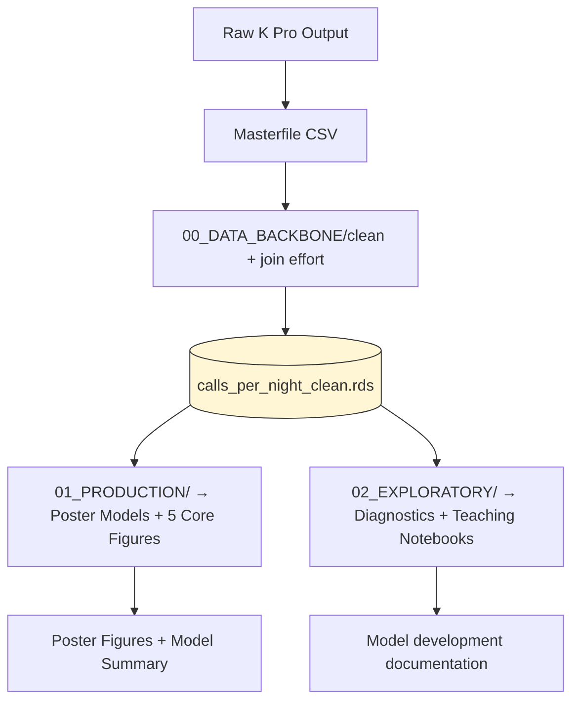

# 🦇 Project Overview  
**Evaluating Habitat Edge Influence on Bat Acoustic Activity Using a Negative Binomial GAMM**

---

## 🎯 Objective

Determine whether bat acoustic activity (**total bat calls per night**) differs significantly between **interior**, **edge**, and **open** detector placements, after accounting for unequal recording effort, temporal variation, and the hierarchical structure of detectors nested within study sites.

---

# 1. Background & Justification

Acoustic monitoring informs management decisions about species presence, activity, and habitat associations. However, detector placement strategies vary widely, especially around **habitat edges**, which may inflate or depress detection rates.

This project tests whether detector placement along a **habitat gradient (interior → edge → open)** affects measured bat activity when controlling for real-world data collection challenges:

| Challenge | Modeling Response |
|---|---|
| Overdispersed count data | Negative Binomial family |
| Unequal recording durations | Offset term (`log(recording_hours)`) |
| Seasonal activity decline (Oct 4–Nov 1) | Smooth term on time (`s(night_scaled)`) |
| Detectors nested within sites | Random effects / `s(detector_id, site)` |
| Missing nights & staggered starts | GAMM accommodates unbalanced designs |

---

# 2. Study Design

### 2.1 Spatial Structure
- **3 independent sites** (> 400 m apart)
- **3 detectors per site (N = 9)**
  - Interior → 50 m into forest, facing away from edge
  - Edge → boundary line, oriented parallel to edge
  - Open → 50 m into open habitat, facing away from forest

### 2.2 Temporal Structure
- **Oct 4 – Nov 1 (28 nights)**
- Deployment stagger:
  - 3 detectors on Oct 4
  - 6 detectors on Oct 5
- Start time adjusted from **6:00PM → 5:30PM** on Oct 23 due to sunset shift
- Multiple incomplete nights due to:
  - SD card fill
  - user error
  - detector malfunction

### 2.3 Response Variable
- **Total bat call files per night (all species pooled)**
  - aligns with detector-placement guidance objectives
  - species / guild models planned as future extensions

---

# 3. Research Question & Hypothesis

> **RQ:** Does habitat placement (interior, edge, open) significantly influence nightly bat activity?

**H₀:** Habitat category has *no significant effect* on bat activity.  
**H₁:** Habitat category has a *significant effect* on bat activity.  

⚠️ *No directional hypothesis is assumed.*  
We do **not** presuppose edges increase or decrease activity — inference is data-driven.

---

# 4. Model Structure

Primary NB-GAMM candidate:

```r
calls ~ habitat +
        s(night_scaled, k = 7) +
        offset(log(recording_hours)) +
        s(site, bs = "re") +
        s(detector_id, site, bs = "re")
```
|Component|Description|
|---|---|
|`habitat`|categorical (Interior / Edge / Open)|
|`s(night_scaled)`|time smooth for migration pulse + seasonal decline|
|`offset(log(recording_hours))`|duration-effort correction|
|`s(site)`|random intercepts for site differences|
|`s(detector_id, site)`|detectors nested within sites|

**Method:** GAMM via `mgcv`  
**Distribution:** Negative Binomial (supported via dispersion)  
**Inference:** AIC model comparison + parametric significance tests  
**α:** 0.05

---

# 5. Data Workflow Philosophy

🚨 **ONE repo, TWO analysis layers** — no duplicate pipelines.



### ⭐️ Key Principles

- **All variables** generated in one pipeline: `00_DATA_BACKBONE/`
    
- Both downstream layers use the _same exact objects_
    
- No “secret scripts” or ad hoc manual edits
    

---

# 6. Repository Structure

```bash
bat-edge-GAMM/
├─ 00_DATA_BACKBONE/              # Master data spine
│   ├─ 00_import_raw.R
│   ├─ 01_effort_offsets.R
│   ├─ 02_construct_calls_per_night.R
│   └─ outputs/
│       ├─ calls_per_night_clean.csv
│       └─ calls_per_night_clean.rds
│
├─ 01_PRODUCTION/                 # Poster-ready workflow
│   ├─ 10_model_nb_gamm.R
│   ├─ 11_prediction_and_plots.R
│   ├─ 12_summary_tables.R
│   └─ poster_outputs/
│       ├─ figs/
│       └─ tables/
│
├─ 02_EXPLORATORY/                # Pedagogical modelling notebooks
│   ├─ E1_variable_construction.qmd
│   ├─ E2_distribution_checks.qmd
│   ├─ E3_random_effects_tests.qmd
│   ├─ E4_sensitivity_models.qmd
│   └─ E5_diagnostics.qmd
│
├─ poster.qmd                     # Final Quarto poster
└─ obsidian_ref/
    ├─ PROJECT_OVERVIEW.md        # (this file)
    ├─ assumptions.md
    ├─ model_notes.md
    ├─ codebook.md
```

---

# 7. Expected Outputs

### 📌 Poster Figures (production layer)

1. Study layout diagram (interior / edge / open)
    
2. Raw calls per night — faceted by habitat
    
3. Smooth of time `s(night_scaled)`
    
4. Predicted calls ± CI by habitat class
    
5. Mini diagnostics (Q-Q + residual panel)
    

### 🧠 Teaching Figures (exploratory layer)

- Why NB not Poisson (variance vs mean)
    
- Influence of offset term (with/without comparison)
    
- Habitat effect partial residuals
    
- Random intercept variance demonstration
    
- Model component incremental build plots
    

---

# 8. Known Limitations

- All species pooled; community composition not addressed
    
- Single season (≈28 days) limits temporal inference
    
- Migration pulse may disproportionately shape smooth term
    
- Uneven recording effort introduces uncertainty even with offsets
    

---

# 9. Next Steps

1. Finalize variable construction scripts
    
2. Import calls_per_night into `00_DATA_BACKBONE/`
    
3. Run candidate NB-GAMM models
    
4. Compare habitat model vs null / time-only model
    
5. Generate poster outputs & summary text
    

---

# 10. One-Sentence Summary (for poster)

> We used a Negative Binomial Generalized Additive Mixed Model to test whether detector placement (interior, edge, open) influences nightly bat call activity while controlling for temporal decline, unequal recording effort, and detector/site nesting.

---

# 🧩 Appendix: Why One Repo, Two Layers?

|Layer|Purpose|Shares Data?|Output Quality|
|---|---|---|---|
|`01_PRODUCTION/`|Public-facing inference|✔️|Final models, poster figures|
|`02_EXPLORATORY/`|Internal pedagogy & transparency|✔️|Diagnostics, parameter logic|

✨ **This avoids duplication**, supports reproducibility, and keeps a clean separation between _inference_ and _understanding_.

---

# 🎉 End of File